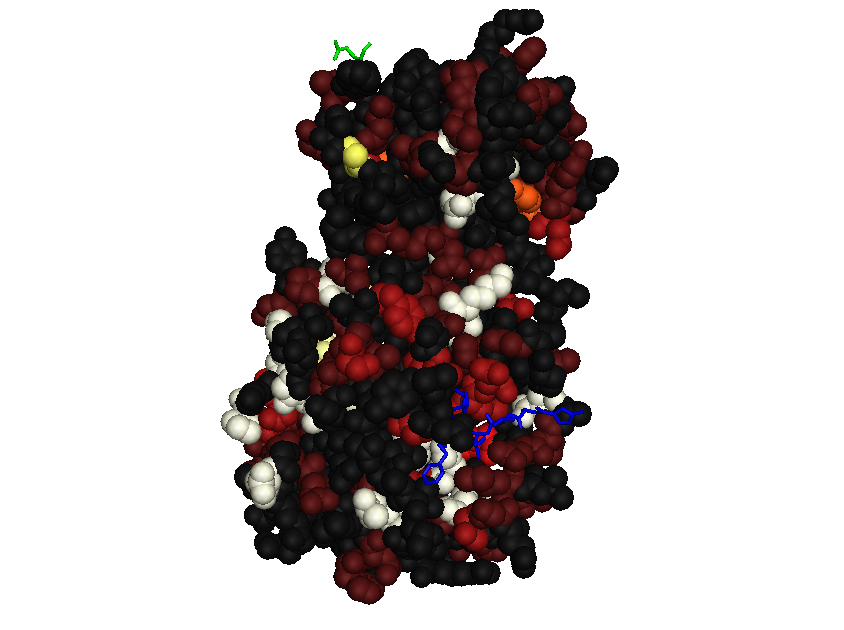
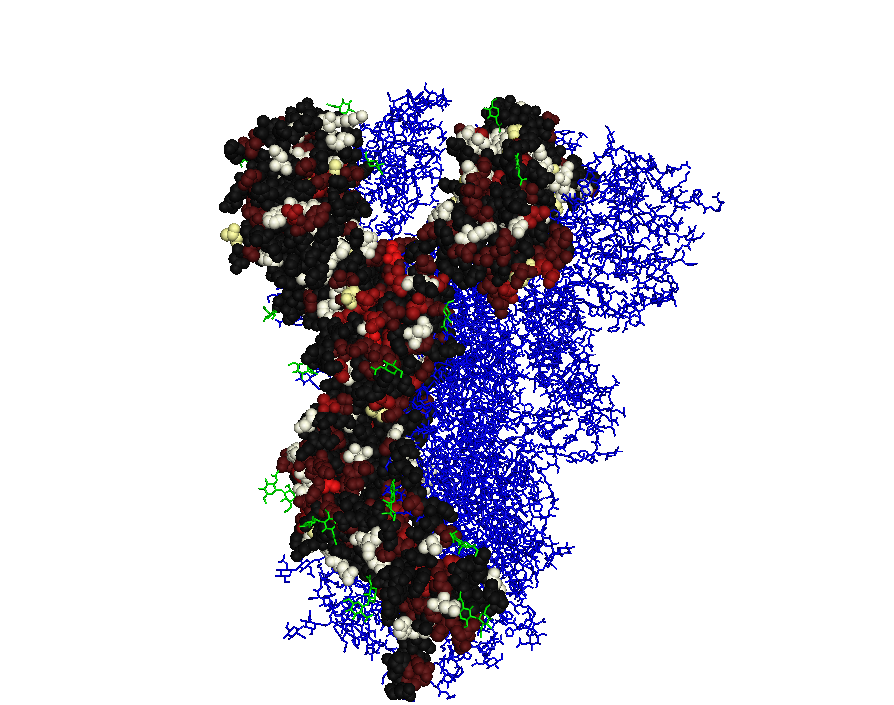

# COVID19 Hackery

This repo contains miscellaneous exploratory work related to Covid-19.

## Personal Warm-Up Project

The main purpose of this project is to get me started and somewhat
familiarised with Covid-19 bioloty and resources. My idea is to map
variation information to protein structures. Initially, get variation
information from `variant_list.tsv` and use PDB files `pdb6lu7.ent`
and `6vsb.pdb`.

### Software

* Linux, Ubuntu 16.04 (xenial) http://releases.ubuntu.com/xenial/
* Python 3.5.2 (newer Python versions should work too)
* Biopython http://biopython.org/ 1.66
* EMBOSS 6.6.0 (for the `needle` program)
* PyMOL 1.7.2

Version numbers are stated for reproducibility purposes. They result
from the Linux system I use (xenial) and the software versions
provided by the packages in the standard repository for this
distribution. Nothing specific to these versions is used, generally
the software should work on any reasonably modern distribution with no
or only minor changes.

### External Materials

* Covid-19 main proteinase `pdb6lu7.ent`: downloaded from
  https://www.ebi.ac.uk/pdbe/entry/pdb/6lu7
* Covid-19 spike protein `6vsb.pdb`: downloaded from
  https://www.rcsb.org/structure/6vsb (currently not used)
* `NC_045512.2.gb`: downloaded from
  https://www.ncbi.nlm.nih.gov/nuccore/NC_045512.2/
* `variant_list.tsv`: downloaded from
  https://covid19.galaxyproject.org/genomics/4-variation/#analysis-of-illumina-paired-end-data

### Method

Variation levels for an amino acid are computed from the variant list
by counting the number of nucleotides occurring in each position of
the codon. This results in a number between 1 and 4 (the reference
nucleotide and any variants all count). Adding these three numbers
gives a level ranging from 3 (no variation at all) to 12 (all bases
occur in all three positions). Corresponding colours range from dark
grey (no variation) via red and yellow towards white (maximal
variation).

#### Matching Genomic Codons to Amino Acids in 3D Protein Structures

Amino acid sequences from features in the genome (`NC_045512.2`) do
not always match up by position to the amino acids included in a PDB
file. More specifically, the amino acid sequence extracted from the C
chain of the spike protein (`6vsb`) is fragmented and some patches of
sequences present in the genomic feature (with a `product` qualifier
of `surface protein`) are not present in the PDB file.

Therefore amino acid residues are matched up individually as follows:

* determine the sequence of the feature as the _feature sequence_, and
  translate it to obtain the _translated feature sequence_.

* extract the amino acid sequence of the relevant chain in the PDB
  file to obtain the _chain sequence_, and record the index of each
  residue as the _residue index_ (1-based, following PDB conventions I
  think).

* compute an alignment of the translated feature sequence and the chain
  sequence, and, for each nucleotide in the feature sequence, record
  the index of the aligned residue in the chain sequence as the
  _chain index_; record `None` for nucleotides encoding amino acids
  aligned to a gap character.

Using the chain index and the residue index, variant information from
the feature sequence can be mapped to residues in the chain. This
method can be used for any other per-nucleotide information from
feature sequences. Aggregating such information from multiple variant
genome sequences would require a genome to reference genome mapping
index.

### Code

See Python script [covidprotstruct](covidprotstruct).

### Demo Result

The images below shows the Covid-19 main protease subunit (6lu7) and
the spike protein (6vsb) with amino acid residues coloured to indicate
level variation.

Note: An early version of the protease image showed rather different
colours due to an indexing bug which is now fixed. However, generally
the code in this repo, which was used to generate these images, is
very preliminary. The images are illustrative of this project's idea,
but their accuracy and correctness should be assessed by reviewing the
code before using them to infer any specific biochemical conclusions.

### Remarks for Discussion

The method to compute variation levels is crude. Nonetheless, the
image above seems to suggest that some parts of the proteins are more
strongly conserved than others.

### Further Ideas

* Use more reasonable / sensitive diversity indices, perhaps by
  getting more detailed information from the BAM files underlying the
  variation list.
* Apply approach to other proteins (the spike protein is more tricky
  than anticipated because the sequence represented in the PDB file
  appears to be incomplete and fragmented, and also it does not
  exactly match up to the amino acid sequence implied by the Covid-19
  genome used here.

## Sources and Resources

In this section I collect references to stuff that I noticed up and
down the Web and that appeared of sufficient interest to me to keep a
reference to them. 

### Data, Computational Resources

* [COVID-19 Data Platform](https://www.ebi.ac.uk/covid-19) hosted by EBI
* [ELIXIR support for SARS-CoV-2 research](https://elixir-europe.org/covid-19-resources)
* [rOpenStats COVID19 package](https://github.com/rOpenStats/COVID19)

### Hackathons etc.

* [ BioHackathon covid-19-bh20](https://github.com/virtual-biohackathons/covid-19-bh20/wiki)
* [mindstream-ai CoronaHack - AI vs.
  Covid-19](https://www.eventbrite.com/e/coronahack-ai-vs-covid-19-tickets-99337559314)
* [hackseqRNA: COVID-19 Ultra-hackathon](https://www.hackseq.com/rna)
* [#CodeVsCOVID19: A Global 72h Online Hackathon to fight
  COVID-19](https://www.meetup.com/Data-Science-Festival-London/events/269622757/)
  organised by Data Science Festival
* https://www.codevscovid19.org/ -- first edition started 27 March but there may be more editions?

### Coding Resources

* [PyCOVID](https://github.com/sudharshan-ashok/pycovid)
* [Coronavirus Tracker API](https://github.com/ExpDev07/coronavirus-tracker-api)

### Epidemiologica Modelling

* [Potential Long-Term Intervention Strategies for
  COVID-19](https://covid-measures.github.io/), includes a section on
  the "lightswitch" approach of relaxing restrictions as numbers of
  hospitalised people decline but re-imposing them when a new surge
  occurs.
* [Epidemic Calculator](https://gabgoh.github.io/COVID/index.html) by Gabriel Goh
* [COVID-19 reports](https://www.imperial.ac.uk/mrc-global-infectious-disease-analysis/news--wuhan-coronavirus/) from Imperial College
* [COVID-19 Scenarios](https://neherlab.org/covid19/) (Neher lab)