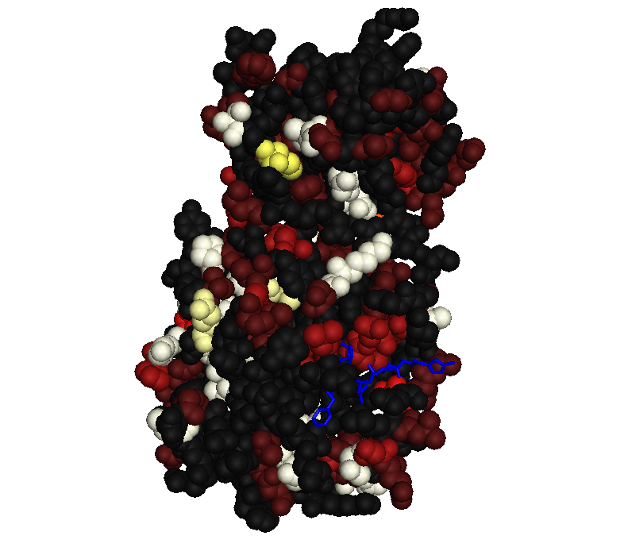

# COVID19 Hackery

This repo contains miscellaneous exploratory work related to Covid-19.

## Personal Warm-Up Project

The main purpose of this project is to get me started and somewhat
familiarised with Covid-19 bioloty and resources. My idea is to map
variation information to protein structures. Initially, get variation
information from `variant_list.tsv` and use PDB files `pdb6lu7.ent`
and `6vsb.pdb`.

### Software

* Linux, Ubuntu 16.04 (xenial) http://releases.ubuntu.com/xenial/
* Python 3.5.2 (newer Python versions should work too)
* Biopython http://biopython.org/ 1.66
* PyMOL 1.7.2

### External Materials

* Covid-19 main proteinase `pdb6lu7.ent`: downloaded from
  https://www.ebi.ac.uk/pdbe/entry/pdb/6lu7
* Covid-19 spike protein `6vsb.pdb`: downloaded from
  https://www.rcsb.org/structure/6vsb (currently not used)
* `NC_045512.2.gb`: downloaded from
  https://www.ncbi.nlm.nih.gov/nuccore/NC_045512.2/
* `variant_list.tsv`: downloaded from
  https://covid19.galaxyproject.org/genomics/4-variation/#analysis-of-illumina-paired-end-data

### Method

Variation levels for an amino acid are computed from the variant list
by counting the number of nucleotides occurring in each position of
the codon. This results in a number between 1 and 4 (the reference
nucleotide and any variants all count). Adding these three numbers
gives a level ranging from 3 (no variation at all) to 12 (all bases
occur in all three positions). Corresponding colours range from dark
grey (no variation) via red and yellow towards white (maximal
variation).

### Code

See Python script [covidprotstruct](covidprotstruct).

### Demo Result

The image below shows the Covid-19 main protease subunit with amino
acid residues coloured to indicate level variation.

### Remarks for Discussion

The method to compute variation levels is crude. Nonetheless, the
image above seems to suggest that some parts of the protease are more
strongly conserved than others.

### Further Ideas

* Use more reasonable / sensitive diversity indices, perhaps by
  getting more detailed information from the BAM files underlying the
  variation list.
* Apply approach to other proteins (the spike protein is more tricky
  than anticipated because the sequence represented in the PDB file
  appears to be incomplete and fragmented, and also it does not
  exactly match up to the amino acid sequence implied by the Covid-19
  genome used here.

## Sources and Resources

In this section I collect references to stuff that I noticed up and
down the Web and that appeared of sufficient interest to me to keep a
reference to them. 

### Data, Computational Resources

* [COVID-19 Data Platform](https://www.ebi.ac.uk/covid-19) hosted by EBI
* [ELIXIR support for SARS-CoV-2 research](https://elixir-europe.org/covid-19-resources)
* [rOpenStats COVID19 package](https://github.com/rOpenStats/COVID19)

### Hackathons etc.

* [ BioHackathon covid-19-bh20](https://github.com/virtual-biohackathons/covid-19-bh20/wiki)
* [mindstream-ai CoronaHack - AI vs.
  Covid-19](https://www.eventbrite.com/e/coronahack-ai-vs-covid-19-tickets-99337559314)
* [hackseqRNA: COVID-19 Ultra-hackathon](https://www.hackseq.com/rna)
* [#CodeVsCOVID19: A Global 72h Online Hackathon to fight
  COVID-19](https://www.meetup.com/Data-Science-Festival-London/events/269622757/)
  organised by Data Science Festival
* https://www.codevscovid19.org/ -- first edition started 27 March but there may be more editions?

### Coding Resources

* [PyCOVID](https://github.com/sudharshan-ashok/pycovid)
* [Coronavirus Tracker API](https://github.com/ExpDev07/coronavirus-tracker-api)

### Epidemiologica Modelling

* [Potential Long-Term Intervention Strategies for
  COVID-19](https://covid-measures.github.io/), includes a section on
  the "lightswitch" approach of relaxing restrictions as numbers of
  hospitalised people decline but re-imposing them when a new surge
  occurs.
* [Epidemic Calculator](https://gabgoh.github.io/COVID/index.html) by Gabriel Goh
* [COVID-19 reports](https://www.imperial.ac.uk/mrc-global-infectious-disease-analysis/news--wuhan-coronavirus/) from Imperial College
* [COVID-19 Scenarios](https://neherlab.org/covid19/) (Neher lab)